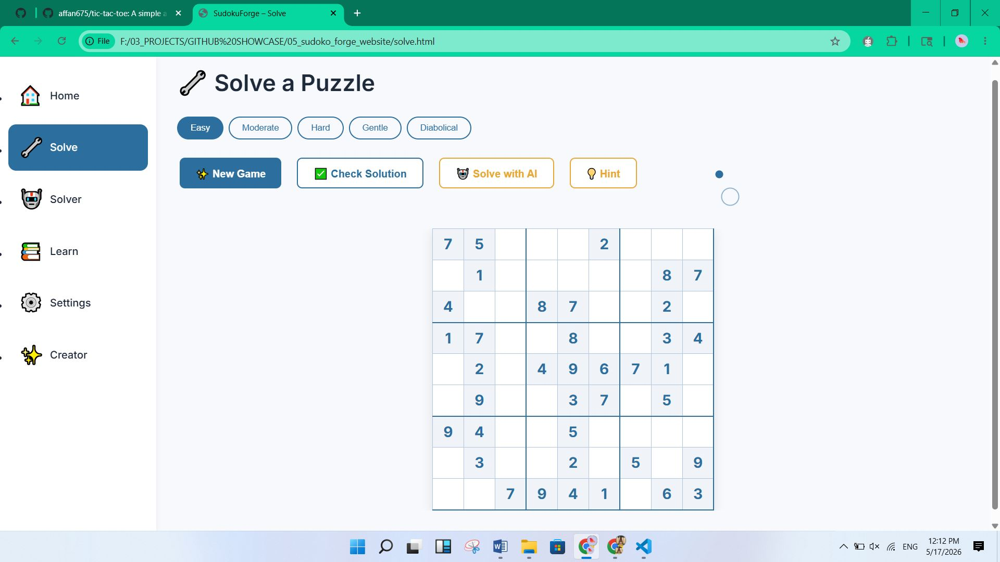
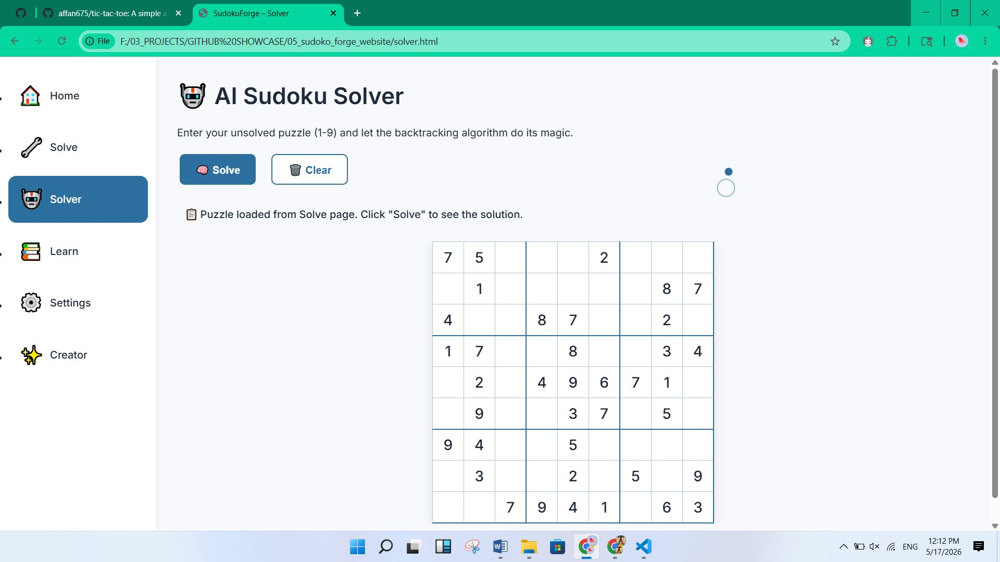
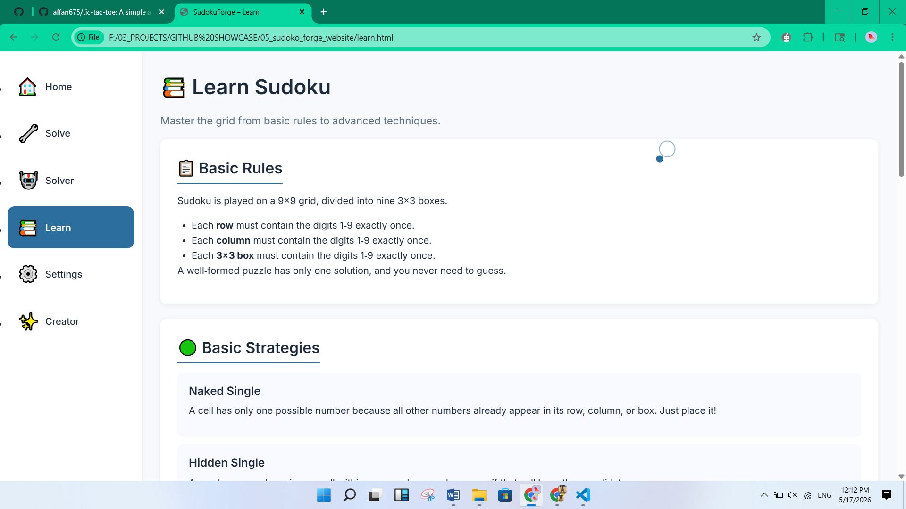
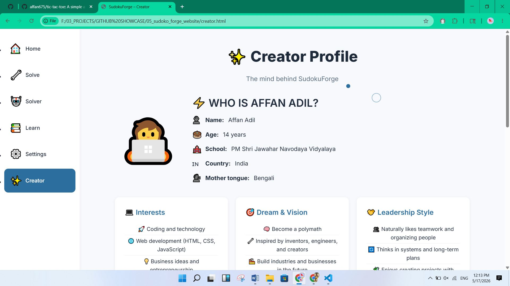
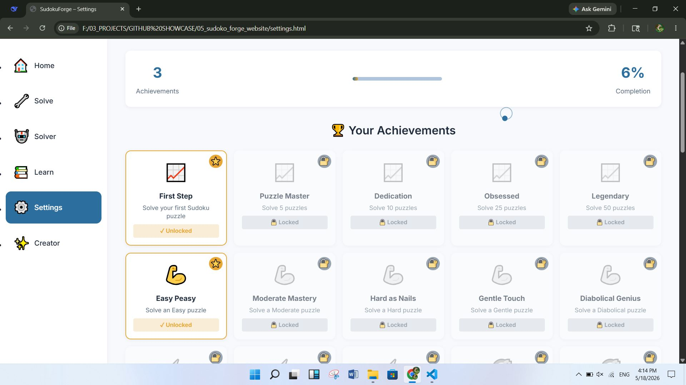

# 🧩 SudokuForge

> Forge your logic. Solve the grid.

<p align="center"> 
   
</p>

<p align="center"> 
  <a href="#"></a> 
  <a href="#"></a> 
  <a href="#"></a> 
  <a href="#"></a> 
  <a href="#"></a> 
</p>

## 📖 Table of Contents
- [Overview](#-overview)
- [Features](#-features)
- [Screenshots](#-screenshots)
- [Live Demo](#-live-demo)
- [Tech Stack](#-tech-stack)
- [Installation](#-installation)
- [Usage](#-usage)
- [Project Structure](#-project-structure)
- [Contributing](#-contributing)
- [Roadmap](#-roadmap)
- [License](#-license)
- [Acknowledgments](#-acknowledgments)
- [Authors](#-authors)

## 📌 Overview
SudokuForge is a fully client‑side Sudoku web application built with vanilla HTML, CSS, and JavaScript. It offers:

*   A puzzle generator with five difficulty levels
*   An AI backtracking solver that can solve any valid puzzle
*   A hint system that suggests logical moves
*   A learning centre with techniques and a 4×4 practice grid
*   Keyboard shortcuts, right‑click context menu, and a 50‑achievement system

The project originated from the `SUDOKU_GAME_PROTOTYPE` repository and has been significantly extended with modern UI/UX, gamification, and accessibility features.

## ✨ Features

| Category | Highlights |
| :--- | :--- |
| **🎮 Gameplay** | 5 difficulty levels (Easy, Moderate, Hard, Gentle, Diabolical) – puzzle generator with unique solutions |
| **🤖 AI Solver** | Backtracking algorithm – instant solution for any valid puzzle |
| **💡 Hint Engine** | Naked single strategy – highlights the cell and fills the correct number |
| **⌨️ Keyboard Shortcuts** | `1-9` enter number, `Delete` clear, `N` new game, `S` solve, `H` hint, `U` undo, `R` redo, arrow keys navigation |
| **🖱️ Right‑Click Menu** | Custom context menu for fast number entry, clear, hint, and pencil marks |
| **🏆 Achievements** | 50 achievements across 15 categories (Progress, Difficulty, Speed, Skill, AI, Creation, etc.) |
| **⚙️ Settings Dashboard** | View shortcuts, right‑click details, and track achievement progress |
| **📚 Learn Page** | Sudoku rules, basic/intermediate/advanced strategies, interactive 4×4 practice grid |
| **🎨 UI/UX** | Responsive design, custom cursor, animated loader with rotating tips, fade‑in animations |
| **🔄 Cross‑Page Transfer** | Puzzles from “Solve” page can be sent to “AI Solver” with one click |

## 🖼️ Screenshots
<details> 
<summary>📸 Click to expand</summary>

| Home | Solve | AI Solver |
| :---: | :---: | :---: |
|  |  |  |

| Learn | Creator | Settings |
| :---: | :---: | :---: |
|  |  |  |
</details>

## 🚀 Live Demo
> **Note:** The project is fully static. You can run it locally or deploy to any static hosting service (GitHub Pages, Netlify, Vercel).
> *Live demo placeholder – open index.html in your browser.*

## 🛠️ Tech Stack
*   **HTML5** – Semantic markup, accessibility‑friendly structure
*   **CSS3** – CSS variables, Grid/Flexbox, custom animations, responsive breakpoints
*   **JavaScript (ES6)** – Puzzle generation, backtracking solver, event handling, DOM manipulation
*   **LocalStorage** – Cross‑page puzzle transfer and achievement persistence
*   *No frameworks or external dependencies – pure vanilla code.*

## 📦 Installation
1. **Clone the repository**
   ```bash
   git clone https://github.com/affan675/SUDOKU_GAME_PROTOTYPE.git
   cd SUDOKU_GAME_PROTOTYPE
   ```
2. **Open the application**
   *   Double‑click `index.html` in your file explorer, OR
   *   Use a local development server (recommended):
     ```bash
     npx serve .
     ```
     *Or use the VS Code "Live Server" extension.*

No build steps or package installation required.

## 🎮 Usage 
*   **Play Sudoku** – Go to `solve.html`, choose a difficulty, click **New Game**, then fill the grid.
*   **Get a Hint** – Click the 💡 **Hint** button – the engine will fill one logical cell.
*   **AI Solve** – Click 🤖 **Solve with AI** to send the current puzzle to the AI Solver page.
*   **Standalone AI Solver** – Visit `solver.html`, enter any custom puzzle, and click 🧠 **Solve**.
*   **Learn Strategies** – Explore `learn.html` for rules and techniques, plus a 4×4 practice grid.
*   **View Achievements** – Open `settings.html` → User Profile tab.
*   **Keyboard Shortcuts** – Focus any cell and press keys (works on Solve and Solver pages).
*   **Right‑Click Menu** – Right‑click any empty cell for quick actions.

## 📁 Project Structure 
```text
SUDOKU_GAME_PROTOTYPE/
├── index.html           # Home page with carousel
├── solve.html           # Interactive puzzle solving
├── solver.html          # AI solver (backtracking)
├── learn.html           # Tutorials and 4×4 practice
├── creator.html         # Dual‑credit creator profile
├── settings.html        # Keyboard shortcuts & achievements
├── css/
│   ├── variables.css    # CSS custom properties
│   ├── style.css        # Main styles
│   ├── responsive.css   # Mobile/tablet breakpoints
│   ├── loader.css       # Loader overlay animation
│   ├── cursor.css       # Custom cursor styles
│   ├── animations.css   # Fade‑in / slide‑in keyframes
│   └── sidebar.css      # Sidebar navigation styles
├── js/
│   ├── main.js          # Sidebar loading, cursor, global init
│   ├── solve.js         # Puzzle generation, rendering, game logic
│   ├── ai_solver.js     # Backtracking solver core
│   ├── hint.js          # Hint engine (naked single)
│   ├── key-shortcut.js  # Global keyboard shortcuts
│   ├── right-click.js   # Custom context menu
│   ├── achievements.js  # 50‑achievement system
│   ├── loader.js        # Loader with rotating tips
│   ├── tab-switch.js    # Dynamic page title
│   ├── home-carousel.js # Home page image carousel
│   ├── creator.js       # Typing effect on creator page
│   └── cycle.js         # (Additional utility)
├── components/
│   └── sidebar.html     # Reusable sidebar markup
└── assets/
    ├── sudoku/          # Carousel images
    └── screenshots/     # Documentation screenshots
```

## 🤝 Contributing 
Contributions are welcome! Please follow the existing code style and keep changes focused. If you’re adding a new feature, update the relevant documentation and include screenshots.

## 🔮 Roadmap 
- [ ] Publish on GitHub Pages with a live demo URL
- [ ] Add Progressive Web App (PWA) support for offline play
- [ ] Implement advanced hint strategies (hidden pairs, X‑Wing, Swordfish)
- [ ] Add puzzle sharing (export/import as string)
- [ ] Dark / light theme toggle
- [ ] Accessibility improvements (ARIA labels, keyboard‑only navigation)

## 📄 License 
This project is licensed under the MIT License – see the `LICENSE` file for details.

## 🙏 Acknowledgments 
*   **Rajdeep (rajdeep292008-pixel)** – Original repository owner and inspiration. His AI‑augmented “MANHATTAN” coding philosophy and clean modular frontend architecture provided the foundation for this project.
*   **Affan Adil** – Lead developer who designed and implemented the achievement system, keyboard shortcuts, right‑click menu, settings dashboard, modern UI/UX, and all quality‑of‑life enhancements.

## 👤 Authors 
**Affan Adil** – Lead Developer  
Portfolio | Email | GitHub

**Rajdeep** – Original Repository Owner  
GitHub

<p align="center"> Made with ❤️ — forge your logic, solve the grid. </p>